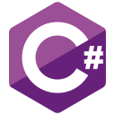

# ⚡ Olá! Seja bem vindo(a) ao meu perfil do GitHub/GitLab. Me chamo Milton Salgado. 

## 📋 Sobre mim

* 👨🏻‍💻 Sou técnico em **Desenvolvimento de Sistemas** formado no **Colégio Pedro II**
* 🎓 Cursei **Sistemas de Informação** na **Universidade Federal do Estado do Rio de Janeiro (1/8)** e atualmente estou cursando **Ciência da Computação** na **Universidade Federal do Rio de Janeiro (2/8)**
* 💻 Estou estudando as seguintes tecnologias: **HTML, CSS, JavaScript, C e C++**
* 🖥️ Estou utilizando as seguintes tecnologias para auxiliar no meu aprendizado: **Visual Studio Code, Git, Github, Gitlens, Canva e Figma**
* ☄️ Sou trainee na empresa júnior **EJCM Consultoria**, na qual estou realizando treinamento técnico para me tornar um desenvolvedor **back-end** ou **front-end**
* 📧 Contate-me no email: <a href="mailto:miltonsalgadoleandro@gmail.com">miltonsalgadoleandro@gmail.com</a>
* 😺 Perfil do GitHub: <a href="https://github.com/milton-salgado" target="_blank">milton-salgado</a>
* 🦊 Perfil do GitLab: <a href="https://gitlab.com/milton-salgado" target="_blank">milton-salgado</a>
* 💼 Perfil do LinkedIn: <a href="https://www.linkedin.com/in/milton-salgado-leandro/" target="_blank">milton-salgado-leandro</a>
* 😁 Pronomes: ele/dele

## 🚀 Painel

 

 

## ⚙️ Tecnologias

### 🔩 Linguagens de Programação, Marcação e Estilização

Linguagens de Programação, Marcação e Estilização que já utilizei para o desenvolvimento.

 &nbsp;  &nbsp;  &nbsp;  &nbsp;  &nbsp;  &nbsp; 

### 🛠️ Ferramentas e Plataformas de Desenvolvimento

Ferramentas e Plataformas de Desenvolvimento que já utilizei para o desenvolvimento.

 &nbsp;  &nbsp;  &nbsp;  &nbsp;  &nbsp;  &nbsp; 

### 🗃️ Sistemas de Gerenciamento de Banco de Dados e Servidores

Sistemas de Gerenciamento de Banco de Dados e Servidores que já utilizei para o desenvolvimento.

 &nbsp; 

### 📄 Linguagens de Documentação

Linguagens de Documentação que já utilizei para o desenvolvimento.

 &nbsp; 

## ✒️ Autor

* **Milton Salgado** - *README* - [GitHub](https://github.com/milton-salgado)

## 🎁 Agradecimentos

* 🖼️ Template: **Armstrong Lohãns** - *Um modelo para fazer um bom README.md* - [GitHub Gist](https://gist.github.com/lohhans/f8da0b147550df3f96914d3797e9fb89);

⚡ ***Milton Salgado - Estudante, Desenvolvedor e Apaixonado por Tecnologia***